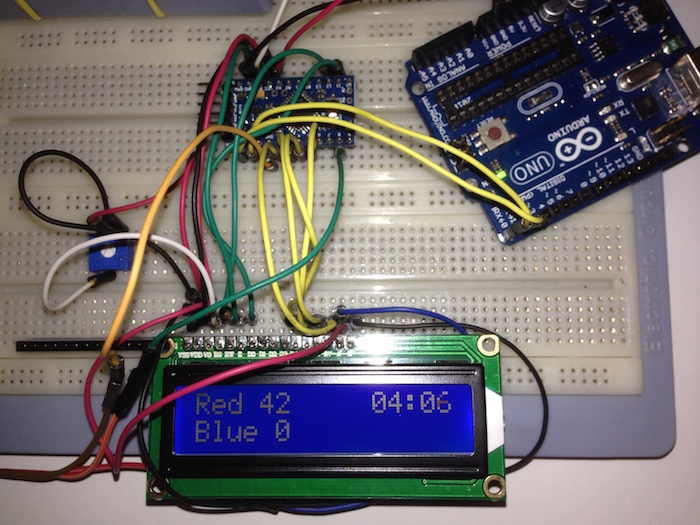

# Automated foosball

This project is used to convert our standard foosball into a digital version to automatically count the score.

## Components

* [LCD display](http://www.dx.com/p/16-x-2-character-lcd-display-module-with-blue-backlight-121356#.VbAWgOiqpBc)
* [Arduino Pro mini](http://www.dx.com/p/arduino-pro-mini-microcontroller-circuit-board-blue-5v-16mhz-178183#.VbAWoOiqpBc)
* [Battery holder](http://www.dx.com/p/14-8v-4-x-18650-battery-holder-case-box-with-leads-103855#.VbAWxOiqpBc)
* [Potentiometer](http://www.dx.com/p/bonatech-potentiometers-deep-blue-10-pcs-326125#.VbAW_-iqpBc)
* [Vibration sensor](http://www.dx.com/p/diy-vibration-switch-sensor-module-for-arduino-black-276589#.VbAXVuiqpBc) Used to detect goals in combination with piece of cardboard in the goals

## Connections

* LCD RS pin to digital pin 12
* LCD Enable pin to digital pin 11
* LCD D4 pin to digital pin 5
* LCD D5 pin to digital pin 4
* LCD D6 pin to digital pin 3
* LCD D7 pin to digital pin 2
* LCD R/W pin to ground
* LCD VSS to ground
* LCD VDD to 5v
* LCD V0 to wiper of 10K resistor (otherwires to 5v and ground)
* LCD A to 5v
* LCD K to ground
* Sensor Team red to 8
* Sensor Team blue to 9

## Todo

* Add official score logic. First to score 10 wins with at least 2 points difference
* Find better sensor to detect goals
* Add function to show winner
